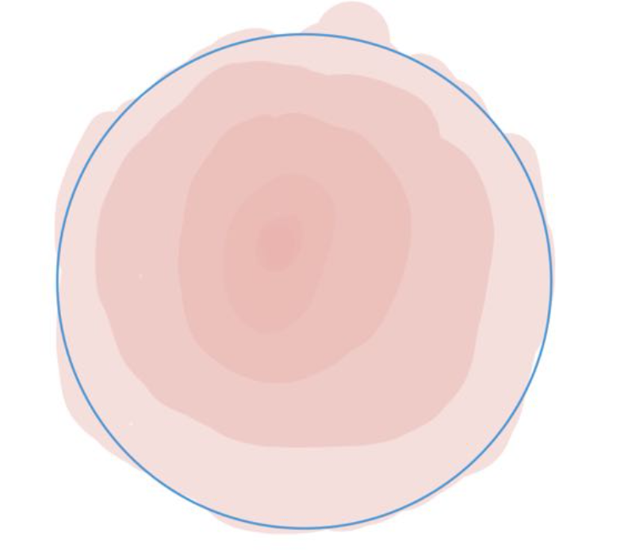
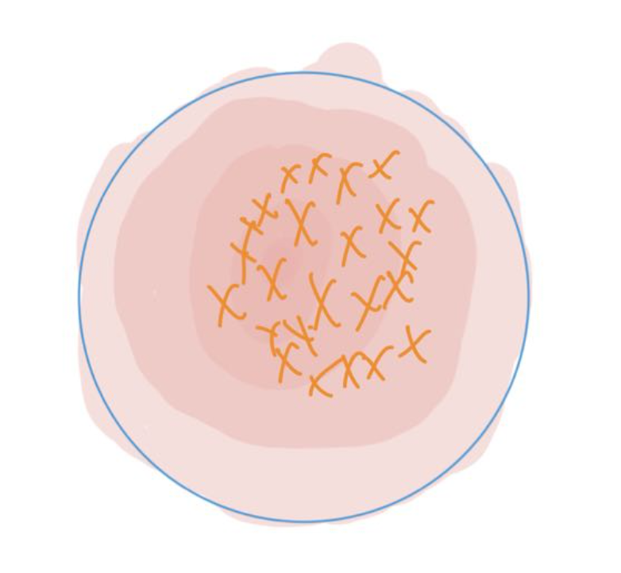
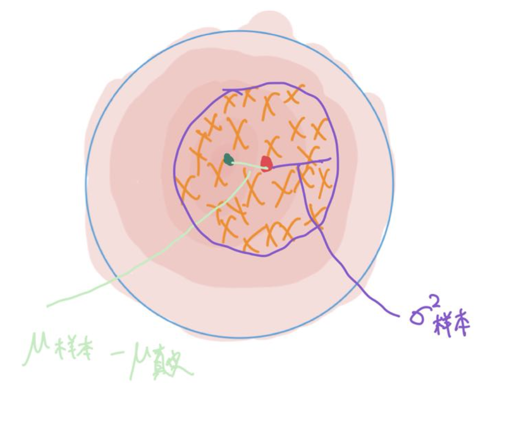

## TL;DR
一个直接输出模型预测值以及其不确定性结果的神经网络模型, 优点是输出的不确定性结果是经过校准的并且对模型本身预测结果的损失并不大, 以及将这个方法迁移到其他的模型非常的容易(比其他直接获取的方法容易得多)
<!--more-->

## 从数学的角度理解不确定性
正如我们针对同一个样本,多次实际测量的结果存在偏差一样,我们预测的值实际上也应该服从某个正态分布. 从 Ensemble 的角度来看应该符合如下的公式
$$ predict =  E[\mu] \qquad AU = E[\sigma^2] \qquad EU = Var[\mu]$$
其中 AU 是随机不确定性 EU 为认知不确定性. 这里说明一下 AU 以及 EU 的道理. 每个预测值都会天然有一个误差,这个误差就是 $\sigma$ ,所以对于多次测量,仍然带有的误差也就是$\sigma$的期望了. 对于 EU 而言, 每次预测出的$\mu$是不一样的,$\mu$代表了一个模型对结果的预测, 如果不同的模型给出的预测都不一样,可以代表这些模型没有达成共识, 侧面说明了这个数据是之前没有见过的, 预测结果差距越大就说明认知不确定性越大.

## Evidential 模型
想要获取认知不确定性,我们需要获得$Var[\mu]$, 其中一种方法是Ensemble 多次测量, 另外一种方法就是 Evidential 模型了
### 模型思想
我们要在一个神经网络模型里直接获取 $Var[\mu]$ 我们其实可以利用共轭先验的方法. 简单来说就是如果我们能够让神经网络预测出一个共轭先验的分布,我们就可以直接算出预测值 AU 以及 EU
#### 共轭先验
先验就是贝叶斯定理中的先验,共轭在这里其实是表示比较容易计算的含义. 
正态分布当$\sigma$已知的情况下,那么他的共轭先验就还是正态分布
正态分布当$\mu$已知的情况下,那么他的共轭先验就是伽马分布
正态分布当$\mu,\sigma$都未知的情况下,那么他的共轭先验就是正太逆伽马分布(Normal Inverse Gamma Distribution, NIG)
我们现在的情况就是$\mu,\sigma$都未知的情况, 所以这里主要研究的是 NIG.
#### NIG
这个分布本质上是分布的分布, 在这个分布中的每个点,代表的都是一个高斯分布, 如图所示.这个分布总共有四个参数$\mu, \lambda, \alpha, \beta$.根据定义可以证得: $$E[x] = \mu \qquad E[\sigma^2] = \frac{\beta}{\alpha-1} \qquad Var[x] = \frac{\beta}{\lambda(\alpha-1)}$$
所以对于神经网络而言,我们只要预测出这四个参数,就可以得到NIG, 有了 NIG (相当于我们得到了很多个预测结果),就可以得到预测值以及不确定性了
### 面临的问题
#### 如何获取 NIG 的四个参数
我们的模型从以前的输出一个预测值变为了输出四个值, 这个其实不难办, 只需要在最后一层引入把输出的维度从 1 变为 4 就好了.并人为规定第几个值是哪个参数就行, 这个改造其实相当的简单,个人感觉与MC Dropout 改造难度差不多(=_=)
#### 如何训练(设计 loss function)
以往针对训练集, 我们可以简单地用 MSE 来作为 loss function,现在可不行了,我们既需要保证训练的$\mu$是准的也需要保证我们的$\sigma^2$是校准过的, 所以我们需要设计一套复杂的函数来作为 loss function. 
我们最终希望的其实是找到一组参数$m$使得我们预测到$y$的概率最大,也就是:
$$ arg\max_{m} \int_{\theta} p(y|\theta)p(\theta|m)d\theta \qquad p(y|\theta)\sim N(\mu|\sigma), p(\theta|m)\sim NIG$$
把高斯分布以及NIG带入公式,进行一些复杂程度的转化(这里比较繁琐但是不难,需要用到的公式有[高斯积分](https://zh.wikipedia.org/wiki/%E9%AB%98%E6%96%AF%E7%A7%AF%E5%88%86)以及伽马积分), 之后即可化简得:

 $$ p(y_i|m) = \frac {\Gamma(1/2+\alpha )}{\Gamma(\alpha )} \sqrt {\frac {v}{\pi }}  (2\beta (1+\upsilon))^ {\alpha } (\upsilon  (y_ {i}-\gamma )^ {2} +2  \beta (1+\upsilon)) ^ {-(\frac {1}{2}+\alpha) } $$

可以把上述公式可以换成$-log$的形式, 也就是:
$$ L_ {i}^ {NLL} = \frac {1}{2} \log _ {(\frac {\pi }{\upsilon})} - \alpha \log ( \Omega )+( \alpha + \frac {1}{2} ) \log ( (y-\gamma )^ {2} \upsilon+ \Omega )+ \log (\frac{\Gamma(\alpha)}{\Gamma(\alpha+1/2))} \qquad \Omega = 2\beta(1+\upsilon) $$
不过光有这个还不够, 因为这样训练出来的$\sigma$会非常的大, 这样所有的点都落在正常的范围内了, 这样预测的准确率就没有效果了.所以我们还需要引入KL-Divergence来保证我们的$\sigma$不会太大. 这里的公式如下:
$$ = \frac {1}{2} \frac {\alpha _ {1}}{\beta _ {1}} (\mu _ {1}-\mu _ {2})^ {2} v_ {2} + \frac {1}{2} \frac {v_ {2}}{v_ {1}} - \frac {1}{2} + \alpha _ {2} \log  (\frac {\beta _ {1}}{\beta _ {2}} )- \log {(\frac {\Gamma(\alpha _ {1})}{\Gamma(\alpha _ {2})})} 
+( \alpha _ {1} - \alpha _ {2} ) \Psi ( \alpha _ {1} )-( \beta _ {1} - \beta _ {2} ) \frac {\alpha _ {1}}{\beta _ {1}} $$
其中$\Psi()$是双伽马函数.
最后将两部分拼到一起就可以了.
## 换个角度理解认知不确定性
在 NIG 分布的公式中我们可以看到 $Var[x]$ 与$E[\sigma^2]$ 只差了一个$\lambda$ 而这个$\lambda$ 在 __学生 t 分布__ 中其实代表的就是 __样本数-1__ 
这不难联想到, 我们在学有偏估计与无偏估计的时候的方差的期望
$E[S^2] = \sigma^2 + Var(x) = \sigma^2 - \sigma^2/n = \frac{n-1}{n}\sigma^2$ 所以有偏和无偏以及这跟不确定性的关系是什么呢
看图!

首先我们有一个分布, 颜色越深表示概率越大

打 X 的地方使我们获取到的数据点,这些点符合我们的分布. 我们可以从这些数据点中求得样本均值以及方差, 但是这跟我们真实分布的均值方差是有区别的! 因为我们的样本不是全量的样本只是从分布中抽样得来的,所以一定不准!

那我们从样本获取到的均值跟真实的均值的差其实就是红点和绿点的偏差, 而 X 数据点的方差就是紫色的$\sigma^2$
我们为什么要做无偏估计呢就是因为我们只统计$\sigma^2$并不能测得我们样本均值与真实均值的偏差, 但是除以1/(n-1) 就可以了这只是因为 Var(x) 与 $\sigma^2$存在这样一个关系.
总的来说我们的 EU 认知不确定性也就是Var(x)也就是抽样得来的样本的与真实均值的偏差的方差也就是无偏估计跟有偏估计中的偏.