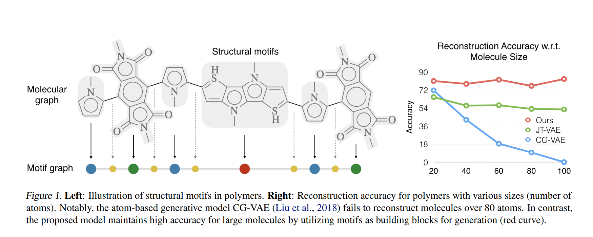

以往的分子图模型都是围绕着粒度较小的单元进行拆分，比如一个原子或者一个小环。而HJT-VAE模型，提供了多粒度的分子表示，从原子层面到connected motifs(连接模态?)
<!--more-->
## 导读
读此文之前建议先了解[JT-VAE](https://kevinvfeng.github.io/2021/06/02/JT-VAE/),是同一作者之前的研究,了解了JT-VAE之后可以很清楚的看到作者在这篇文章具体优化了什么,否则直接理解此文会稍微有些困难,但是不是不能理解.

## 其他模型的问题
### Smiles
以往大多数基于 SMILES 的模型会有一个先天的问题,同一个分子有多个 SMILES 表示,导致每个字符之间的位置关系并不完美.同理,两个相似的分子的 SMILES 的距离(edit distance)可能相差很大.这会导致 VAE 类模型并不能很好的学习到每个字符的平滑 embedding. 
### 原子粒度
其他模型如果采用原子层面的图模型表示的话,也会有一个问题:生成一个苯环结构会先依次生成 6 个原子而不是直接放一个苯环,这几步中间过程生成出的分子很可能是无效的.
### 分子量大的情况
相对于JT-VAE而言,JT-VAE的vocab只有几百条,且基本都是单环,不会有多个并环的存在. 所以JT-VAE在处理多聚体的时候会略显困难.同时很多VAE based模型在重构方面误差会累积,分子量越大,重构起来越困难.尤其对于JT-VAE而言,由于在decoder部分需要遍历所有的有效可能结果,在大分子的时候计算量是指数型增加的,计算能力也是个问题.

## 解决方案
作者主要是针对JT-VAE的问题进行了优化,提升了训练速度以及重构的准确率.
### 基本概念
#### Motif
对于小分子或聚合物而言,它有着非常清晰的层次结构.如下图左侧所示,这图可以分成了几部分,中间这一块称之为 Structural motifs.

这个motif在JT-VAE的时候被称为substructure.二者其实是非常类似的,都是通过把苯环等变成一个整体,从而降低训练的难度.但是区别也是存在的,motif可以是并环或者比较大的结构,而substructure只能是单环之类的比较小的结构.
### HJT-VAE 具体思路
作者提出了基于 motif 的hierarchical-VAE. 这个 motif 是预先就提取好的.在进行分子生成的时候,分子一点一点的往上添加 motif.
HJT-VAE整体需要考虑的事情有三个:
1. Motif的提取
2. Encoder
3. Decoder
### Motif Extraction
这一步属于数据预处理,通过这一步提取出数据集中集中度比较高的Motif,从而构建Vocabulary.作者把每一个 Motif 看成一个分子图中的子图,所有的 Motif 联合起来会覆盖整个分子.在提取 Motif 的时候会执行以下步骤:
1. 断开所有的桥键(断开这个键并不会改变这个分子的有效性),此时会把分子图拆开成几个不连通的子图
2. 提取出训练集中出现次数大于等于 100 的子图
3. 如果某个字图没有被选为 Motif 则把他分解成环和键并作为 motif.
4. 将所有 motif 收集记为 vocab
### Encoder部分
Encoder核心分为三个部分,这三层是从精细的原子连通图到关注连接点的Attachment层再到比较粗糙Motif连接图.
### Atom 层
原子层记录了原子之间是如何连接的,记录了$(u,v)$其中 $u,v$ 是原子.同时还记录了原子之间的键 $b_{uv}$.原子所包含的信息有原子类型以及电荷性(charge).这一层保存了decoding时所需要的产生图的必要信息.
### Attachment 层
这一层决定了 Motif 中的什么节点(原子)与其他 Motif 连接.每个Attachement层中的Node都是两个子图的连接点(原子). $A_i = (S_i,\{v_j\})$ 其中$S_i$为这个连接点所在的Motif, ${v_j}$是Atom层顶点的信息.这一层在decoding时保存了关键连接点的信息, 用于判断每个Motif相连接时应该是哪个原子与哪个原子进行连接.
### Motif 层
这一层记录了 Motif 的信息以及 Motif 之前的大致连接.
注意这里是树结构存储的,理由是在根据Motif生成图的时候通过树形结构会比较容易(其实我感觉这里是因为JT-VAE这么做的,效果还可以就继续沿用了这个方法)
### 层间关系
作者还在层与层之间做了连接,比如从原子到 Attachment 层,以及 Attachment 到 Motif 层,这些层间的连接同样会通过 MPN 传播. 对于 Attachment 和 Motif 其编码方式都是 One-hot. 之所以引入这些连接,从符合直觉的方式讲是为了让信息共享,从实现的角度讲是为了保证Encoder生成Z的时候可以用到所有层的信息.
### Decoder部分
首先从第一个Motif $S_1,A_1$开始,预测$S_2,A_2$ 之后从通过$S_1,S_2,A_1,A_2$去预测$S_3,A_3$以此类推.
即:$P(G) = \int_zP(z)\Pi_kP(S_k,A_k|S_{<k},A_{<k},z)dz$
具体每一步就是先通过motif prediction 预测motif,以及通过该attachment prediction预测attachment. 之后再决定新的motif如何被添加到当前的图中.
### 一些补充
作者这里的思路是倒着想的,为了保证能够重构大分子,首先先提出motif的概念,我们需要先从一个树中一点一点把motif连接好,在连接的过程中考虑如何选择正确的motif,最后考虑具体的连接情况. 在确定好decoder的思路之后根据decoder确定encoder该怎么实现.
## 具体实现细节
### Encoder部分
由于分子的连接方式以及各种层的连接方式都是通过图或树的方式连接的,所以首先提出了MPN方法.
#### Atom MPN
参数说明:
- 原子特征 + embedding -> $e(a_u)$
- 化学键特征 + embedding -> $e(b_{uv})$
将二者联合起来通过MPN网络. 为了尽可能保证信息充分利用,整个图神经网络会循环T遍保证converge.
####  Attachment MPN
$f_{A_i} = MLP(e(A_i),\Sigma_{v\in S_i}h_v$.
其中$e(A_i)$是attachment node的embedding, $h_v$是这个Motif中的其他原子特征.
$\{h_{A_i}\} = MPN({f_{A_i}{e(d_{ij})}})$
其中$d_{ij}$ 表示如果i是j的第几个child, 如果i是父节点的话 $d_ij$就为0
#### Motif MPN
- Motif特征 + embedding -> $e(S_i)$
- attachment的特征 -> $h_{A_i}$
$f_{S_i} = MLP(e(S_i),h_{A_i})$
$\{h_{S_i}\} = MPN({f_{S_i}{e(d_{ij})}})$
#### Z
$Z_G = \mu(h_{S_1}) + exp(\Sigma(h_{S_1})) \times \epsilon 
$
上述公式是经过VAE reparameterization trick过后的,其本质还是利用了$h_{S_1}$ 也就是根节点的Motif特征.

### Decoder部分
#### Motif 
首先先通过上一个节点Motif $S_k$以及$Z_G$ 通过MLP以及softamx 求出下一个motif $S_t$
$P_{S_t} = softmax(MLP(h_{S_k}, Z_G))$
#### Attachment 
同样的方法去预测Attachment
$P_{A_t} = softmax(MLP(h_{S_k}, Z_G))$
通过这个预测能够显著减少排列组合时的计算量
#### Graph
通过将两个Motif的两个子结构,连接组成一对,之后选择最合适的点.进行拼接
$h_M = \Sigma_j MLP(h_{u_j},h_{v_j})$
$P_M = softmax(h_M x Z_G)$
> Hierarchical Generation of Molecular Graphs using Structural Motifs
### Loss
同VAE 不再赘述.

## 点评
训练时作者用的是polymer的数据.对分子量比较大的数据集来说, HJT-VAE无疑是比较好的模型了. 但是对小分子的模型,我比较迟怀疑态度.