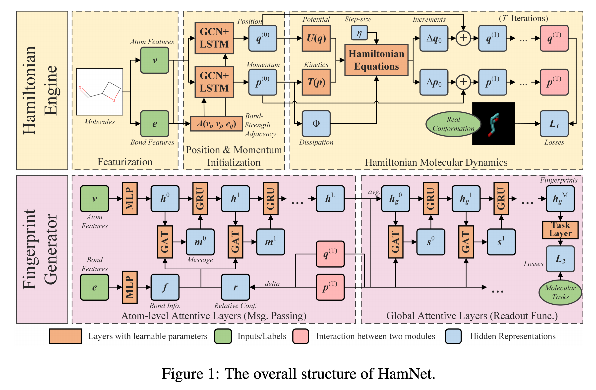

## TL;DR
HamNet 主要利用了 Hamilton 方程来解决 3d 构象问题的分子性质预测模型.
<!--more-->

## 以往的问题
分子的 3d 构象能够表达出很多有意义的信息,比如键长,角度等等,这些信息实际上能够表达出一些分子的物理化学乃至生物医药的信息. 但是以往的模型并不能够很好地利用这些 3d 结构. 不能利用这些信息的主要原因有三个:
1. 计算成本
2. 平移旋转不变性
3. 构象的可用性(the availability of conformations) 个人理解为,不是所有的分子都有确定的 3d 构象
4. 目前 2d 的模型跟 3d 模型相比不差甚至更好

## HamNet的特点

HamNet 利用了 3d 构象作为输入. 不顾哦为了解决构象不存在的问题, HamNet 在设计时,有一个模块称为 Hamiltonian engine. 这个模块用于重构已知的 3d 构象并用于泛化未知的 3d 构象. 
首先将原子的特征进行编码,得到了原子的隐式位置以及动量, 把这二者作为Hamiltonian 方程的输入. 输出则是分子的 3d 构象, 将这个构象与真实的构象相比较对模型进行训练. 之后将训练好的模型的输出喂给 MPNN 来产生分子指纹(特征)用于下游任务.

## 前置知识
### 图神经网络
这个不再赘述, 自己去查吧
### 哈密顿方程(Hamiltonian Equations)
具体不是很了解. 简单来说是一种通过位置以及动量计算体系能量的一个方法
### Kabsch-RMSD
解决 3d 旋转平移不变问题的方法
## 训练流程

### 预训练: <small>训练模型生成 3D 构象</small>
首先先利用包含 3D 空间坐标的训练集训练 Hamiltonian Engine. 希望模型能够根据分子生成出合适的 3D 构象
#### Hamiltonian Engine
如图上半部分所示, 将分子的原子以及键的特征作为输入传入到模型当中,之后计算隐式

