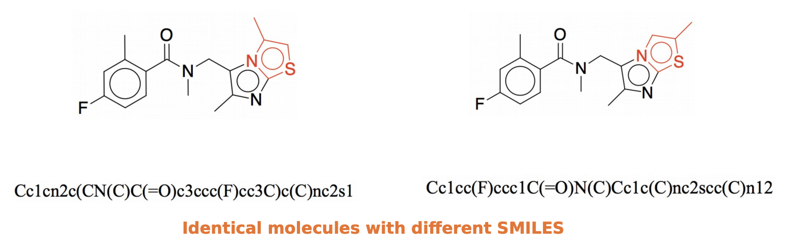
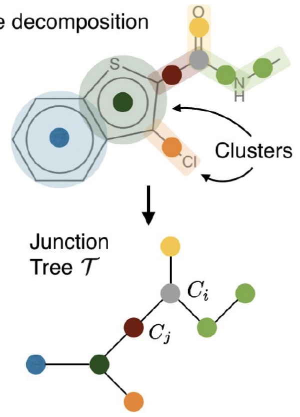

JT-VAE通过利用 juction tree 以及原子图模型解决了分子生成中生成无效分子的问题
<!--more-->
## 写在前面
本篇所介绍的模型,并不需要完全掌握细节,因为就现在 2021 年来看其实这个代码稍微有些过时, 实际效果也并没有那么理想, 所以具体细节不是很重要. 但是作者考虑的将分子图拆解出来的方法是完全可以借鉴思考的,这一部分作者思考的深度是有的.
## 其他模型的问题
作者提出了两个在以往基于 SMILES 的生成模型中存在的问题:
1. Smiles 编码不能帮助人们以及计算机了解分子之间的相似性,如图所示. 换句话说,SMILES 就不是用来表示相似性的.
    
2. 在分子有效性等其他化学指标上,用图表示比用 smiles 更容易一点. 当然这是作者的假设,不过是有道理的
## 解决方案
因为上述的两个问题,所以作者采用了图的方法来做分子生成
## 如果用图会带来什么新问题?
个人理解,其实对于有机分子来说,只要不是环,那分子还是挺像一个计算机学中的图的,但是如果有了苯环等其他环,这个图的处理就会比较麻烦.所以核心还是在怎么处理环上.
对于环简单的办法就是把苯环或者其他的环都看成一个整体,跟原子的地位相当.

如图所示,这就是作者把图变成树的示例.
具体这是怎么变成树的,回头再讲.
## 除了树,还有别的吗?
除了树,作者也存储了所有关于节点的信息
这一部分基本上就是图算法了
## 整体流程
1. 从 SMIELS 搞出图以及 junction tree. 之后分成两步走,一步是 Junction Tree 另一部分是 Atom Graph.
### Junction Tree
从图先通过 Tree Decomposition 生成一个树,之后再将这个树表示成图
#### Tree Decomposition 
1. 通过 rdkit 给分子进行编号
2. 统计所有的不成环的边以及所有的环
3. 将拥有三个及以上共同原子的环连接起来看做一个环(避免桥环). 此处如果仅有两个共同原子则为并环
4. 通过添加节点的方式解决不成环边共享共同原子的在图中成环的方式
5. 通过最小生成树算法搞出一个图
   
至此我们成功的将一个图转化成了一个树
#### Tree -> $Z_T$
1. 找到 root 节点,root 节点是0 号原子所在的基团
2. 先 bottom-up 从最下方的叶子节点向上走传播,传播用的方式是 GRU. 对于一个 Node 如果拥有两个 child-node 则 GRU 会同时引入两个点的 hidden vector之和.
3. 再 top-down ,其实不是很明白为什么要 top-down
4. $Z_T$其实就是$Z_{root}$
### Graph
Graph 相较 Tree Decomposition 多少还是容易一点的.
对于一个分子图,我们能获取到的信息有:
- 原子特征
- 化学键特征
- 原子之间的邻接表
- 化学键的邻接表
通过以上四种信息的组合可以得到分子图这边的表示信息.
#### 原子特征
表示原子的特征有如下几类:
- 原子是什么
- 原子用了几个键
- 有没有手性
- 等 TODO 
将这几个特征拼起来就是原子的特征
#### 化学键特征
同样有多个类来表示化学键
- 键的类型
- 顺反异构
拼接起来就是键的类型

## 参考资料
- [Junction Tree Variational Autoencoder for Molecular Graph Generation](https://arxiv.org/abs/1802.04364)
- [Slides From TDLS](https://github.com/treeforever/tdls.github.io/blob/master/slides/20180924_RouzbehAfrasiabi.pdf) 