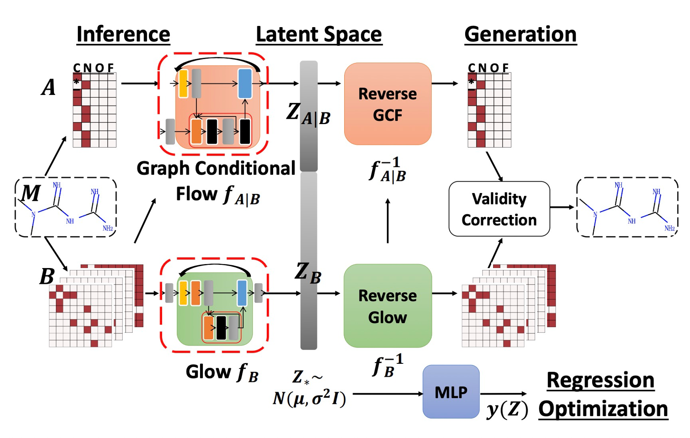
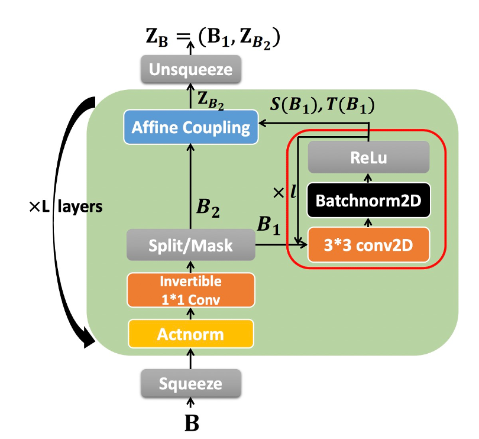
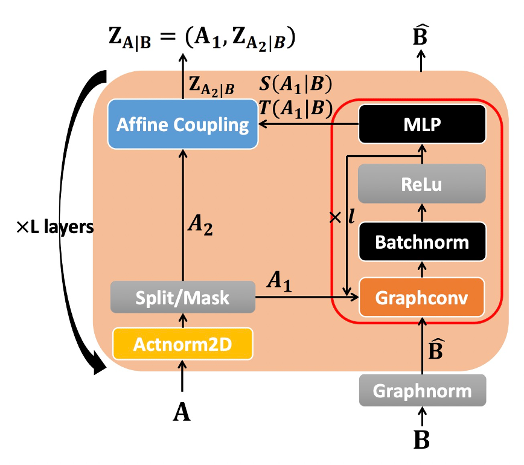
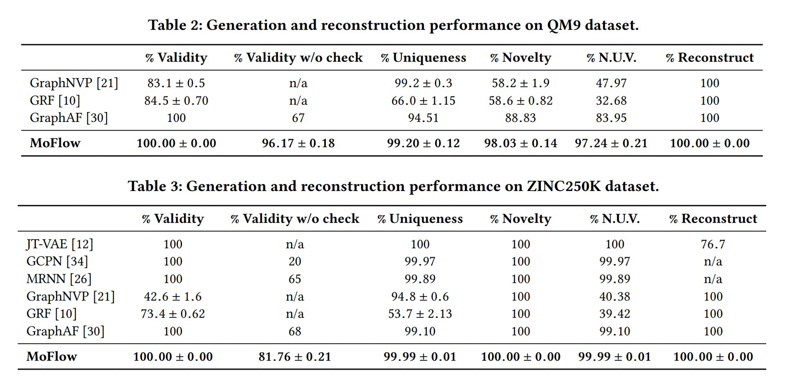
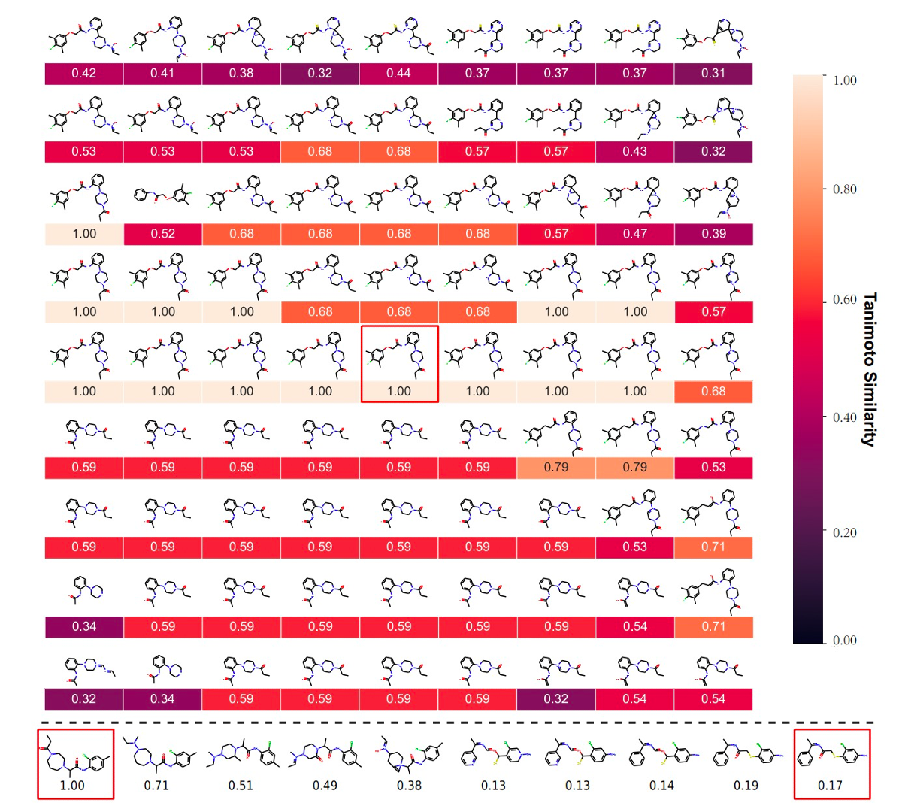
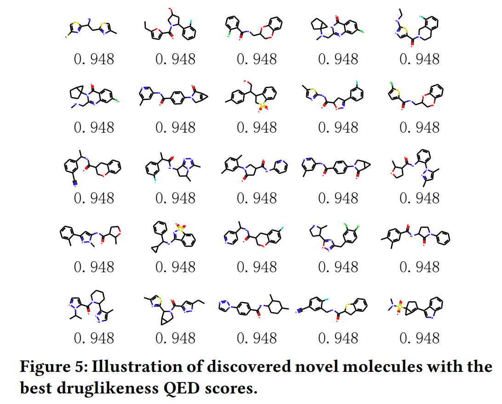

## 前言
看此文之前需要对 NICE 以及 RealNVP Glow 有所了解.
## 概述
MoFlow 把 Glow 中重要的成分全都迁移到了分子生成当中, 并且对于分子图的特性原子(顶点)与化学键(边)跟 NormalizingFlow 进行了良好的融合.但是很多处理还仅仅是停留在照搬 CV 那一套方法的阶段,本土化处理(分子图特性等等)没有做的特别好.

## 模型结构

整体结构如图所示, 一个分子被分成了量部分, 顶点(原子)与边(化学键). 对于原子部分来说, 输入是n\*c的tensor, n 代表原子数, c 代表原子种类用 one-hot embedding表示. 对于边来说,输入就是三个维度了, shape 为 n\*n\*e, e 为化学键种类,同样用 one-hot embedding 表示.
对于flow变换而言,同样分为了关于原子的 Graph Conditional Flow 与关于化学键的 Glow两部分. 先说边这部分, 这部分的输入与 CV 中的图像输入极其相似,所以作者直接照搬了 Glow 的做法,唯一的改动就是在计算仿射的时候不在使用 exp() 把 s 变为正值且易于计算log, 而是为了保证输出在 0-1 之间,使用了 sigmoid 函数. 对于原子表示部分而言, 作者提出了 Graph Conditional Flow 层这一部分的仿射耦合层不仅仅用了输入的一半,还利用了边的信息.这也是为什么被称之为 Conditional. 同样 GCF 中也用了 sigmoid 替代了exp(). 不用担心使用边的信息会对 Flow 的求雅克比行列式以及求逆有任何影响. 毕竟仿射耦合层还是不变的,变的只是复杂变化中的一部分. 

作者在做 Graph Conditional Flow 时用的是 R-GCN.
## 生成分子合理性检查
虽然在重构的时候由于 MoFlow 完全是可逆的,所以一定能 100%还原. 但是在 sample 的时候就不一定了, 生成的分子的化合价有可能是对不上的.所以作者引入了化合价修正机制(很多模型里也有)
约束条件如下:
$$\sum_{c,j} c\times B(c,i,j) \le Valency(Atom_i) + Ch$$ 
其中 $Ch$ 代表 charge 也就是例如 O+ NH4+之类的
具体检查并修正分子合理性的方法如下:
  1. 检查所有分子的化合价是否满足上述约束
  2. 如果所有的原子都没问题,那么就返回最大联通子图并结束
  3. 如果没有,那么就根据这个原子的键进行排序,去删掉排位最大的键.
  4. 继续执行第一步
作者希望这么做可以以最小的修正代价去保证分子的有效性
## 最终效果

在 paper 中可以发现效果还是不过的 例如 validity 和 reconstruct 都是 100% (这是废话,毕竟可逆一定重构, 还引入了 validity check 一定是 valid 的)
那在其他方面例如 uniqueness novelty 什么的都相对较低高, 不过我实测结果发现一般, unique 其实没有那么高. 反而由于不断的 check 的原因, 生成的有效分子很多 但是处理过后可能就没剩几个了

从上图中也可以看到还是有相当大量的分子是重复的, 不过确实生成的分子还比较连续.

作者还做了属性优化的测试, 通过引入监督性得分以及求出z 的梯度, 对 z 进行优化, 从而 sample 出得分好且与 z 相比比较相似的分子.
作者还做了, 两个分子之间求差值等等, 不过这个我试了几个分子 差值出的分子只有一个, 说明模型效果还是不太好.