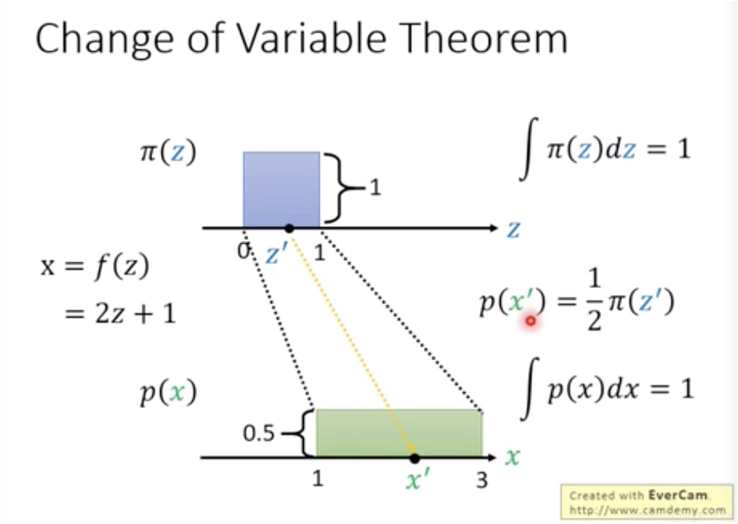
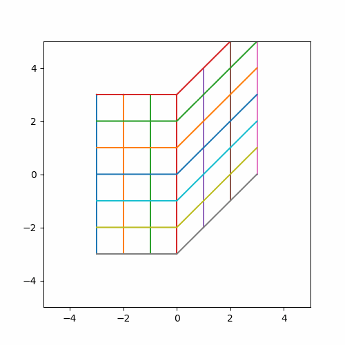
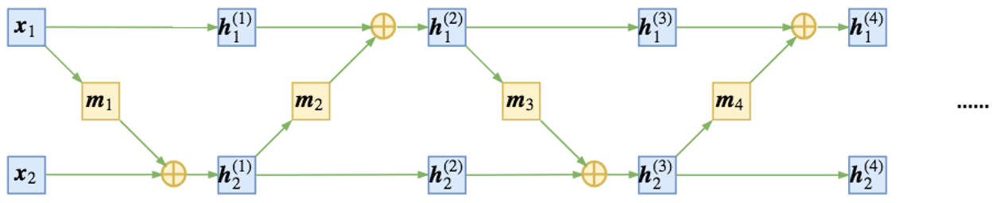
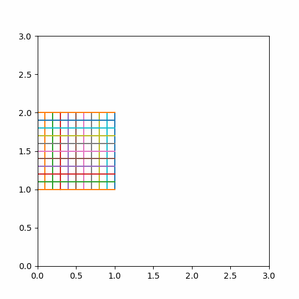
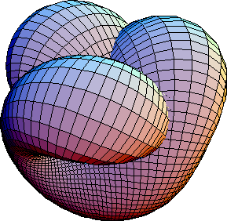

NICE是第一款 Flow-based 模型. Flow-based 是另一种生成模型的方法, 在后续发展中有着不输 GAN 的能力.
<!--more-->
## Additive Coupling Layer

### 基本假设
生成模型实际上的作用是把一个分布通过模型能够转化成另外一个分布. 比如从高斯分布出发,通过一系列的变化成真实照片的分布, 这样有了这个生成模型,我们就可以从高斯分布中 sample 出一个点,经过同样的变化,就能生成一张十分逼真的图片.

对此我们可以写出下面的公式:
$$h=f(x)$$ 其中 h 是转化后的结果, f 转化的函数, x 作为输入
我们假设 h 中每个component 是独立的, 这样就有:
$$p_H(h) = \Pi_d p_{H_d}(h_d)$$
> 需要保证独立的原因是因为这样我们就可以通过单独调整某一个变量达到风格变换的效果
### Change of Variables
另外我们需要找到$p_X(x)$与 $p_H(h)$关系那么就需要用到 change of variables.
> change of variables theory 其实这个就是换元法, y=x 如果 a=2x+1 则 y=(a-1)/2


<div style="color:#999">上图中蓝色面积是 1, 在将 z 换成 x 后, 横坐标拉长了, 为了保证面积一致,我们必须将高度从 1 变成 0.5</div>

根据 change of variables 我们能得出
$$ p_X(x)= p_H(f(x))|det\frac{\partial f(x)}{\partial x}|$$
其中的$\frac{\partial f(x)}{\partial x}$也就是f(x)的雅可比矩阵.
> 为什么变化后要成上一个值? 是因为我们的坐标轴已经发生了变化, 不再是以 x 为基准而是以 h: f(x)作为基准
> 只考虑一个变量 x$\int_{g(a)}^{g(b)}f(x)dx = \int_{a}^{b}f(g(u))g'(u)du$
> 对于二元变量公式:
> $\iint_Rf(x,y)dydx=\iint_Gf(g(u,v)h(u,v))|detJ(u,v)|dudv$
> 其中$J(u,v)$是雅克比行列式不是雅克比矩阵
### 函数可逆
我们能从 x 换到隐变量 h 就还得从 h 换回到 x(需要来回换的理由是,这样就可以把各个样本映射到一个高斯分布中,从而更好地 sample)
所以我们就要求 f(x)是要可逆的,理由是我们需要通过求逆的方式从 z sample 到最终的样本 x 所以就有:
$ x = f^{-1}(h)$
### 遇到的问题
出于对Change of Variables以及函数可逆的考虑我们需要在构建模型的时候满足两点
1. f(x) 需要好算雅可比矩阵的行列
2. f(x) 可以求逆
### 解决方案
先上最终解决办法: 
将 x 分成两半: x1, x2
$$\left\{\begin{aligned}h_1 = & x_1 \\
h_2 = & x_2+m(x_1)\end{aligned}\right.$$

- $h_1 = x_1$ 本身,所以雅克比就是单位矩阵
- $h_2$内部互相独立所以$h_2$与 $x_2$的雅克比也是单位矩阵
- $h_2$ 与 $x_1$ 的雅克比比较复杂不过没有关系因为$h_1$ 与 $x_2$毫无关系所以为 0 这样最终行列式还是 1
  
这样一来雅可比矩阵就可以写成分块矩阵的形式
$$\begin{vmatrix}1 &0\\
\frac{\partial m(x_1)}{\partial x_2}&1\end{vmatrix}$$
至于求逆的方法与正向传播一样简单
$$\left\{\begin{aligned}x_1 = & h_1\\
x_2 = & h_2-m(h_1)\end{aligned}\right.$$
这样的设计能够让我们的函数 $m$设计的非常复杂但是又不影响什么, $m$不需要求逆.
### 缺点
虽然我们找到了一个可以快速计算雅克比行列式 ( 也就是0 )  以及可以简单求逆的方法, 
但是还有一个问题没有解决, __我们的 $x_1$这半部分根本没有变化!__

<div style="color:#999">y=leaky_relu(i)(x) 其中 i 随时间变化. 可以看到竖线的横坐标是不变的</div>
不过对此也有一个解决办法:  我们再叠一个 block同时把 $x_1$,$x_2$ 反过来就可以了. 由于这个$m$ 相对来说还是比较简单的, 每一个 block 都不可能太复杂,所以我们需要很多个 block 来实现复杂的变化,从而提升生成模型的上限.


<div style="color:#999">交替变换h1,h2即可对所有维度进行变换</div>


<div style="color:#999">三层 additive coupling layer 的变换示例</div>
### 为何我们能想到通过这种方式进行训练
1. 先解决的如何快速计算行列式的问题
   我们知道**上下三角矩阵是比较容易计算行列式的**, 其**行列式等于对角线的元素之积**. 由于我们现在想求的是雅克比行列式所以就有下面的形式
   $$\begin{vmatrix}\frac{\partial z_1}{\partial x_1} & 0 & 0 & 0 \\
\frac{\partial z_2}{\partial x_1} & \frac{\partial z_2}{\partial x_2} & 0 & 0 \\
\frac{\partial z_3}{\partial x_1} & \frac{\partial z_3}{\partial x_2} & \frac{\partial z_3}{\partial x_3} & 0 \\
\frac{\partial z_4}{\partial x_1} & \frac{\partial z_4}{\partial x_2} & \frac{\partial z_4}{\partial x_3} & \frac{\partial z_4}{\partial x_4} \\
\end{vmatrix} = \frac{\partial z_1}{\partial x_1}\frac{\partial z_2}{\partial x_2}\frac{\partial z_3}{\partial x_3}\frac{\partial z_4}{\partial x_4}$$

都写成这个样子了不妨再改的的简单一点
   
   $$\begin{vmatrix}1 & 0 & 0 & 0 \\
\frac{\partial z_2}{\partial x_1} & 1 & 0 & 0 \\
\frac{\partial z_3}{\partial x_1} & \frac{\partial z_3}{\partial x_2} & 1 & 0 \\
\frac{\partial z_4}{\partial x_1} & \frac{\partial z_4}{\partial x_2} & \frac{\partial z_4}{\partial x_3} & 1 \\
\end{vmatrix} = 1$$

在上面这种形式下,我们透过雅克比矩阵反推 $z$与 $x$ 关系:
$\left\{\begin{aligned}z_1 =& x_1 + c\\
z_2 = & m(x_1) + x_2+c \\
z_3 = & m(x_1,x_2)+ x_3+c \\
...\end{aligned}\right.$
这样的计算对于函数$m$来说是非常复杂的, 因为他的输入是不固定的.那我们在简化一下:
$$\begin{vmatrix}1 & 0 & 0 & 0 \\
0 & 1 & 0 & 0 \\
\frac{\partial z_3}{\partial x_1} & \frac{\partial z_3}{\partial x_2} & 1 & 0 \\
\frac{\partial z_4}{\partial x_1} & \frac{\partial z_4}{\partial x_2} & 0 & 1 \\
\end{vmatrix} = \begin{vmatrix}I & 0 \\
m(x) & I \end{vmatrix}$$
再次反推$z$与$x$的关系:
$\left\{\begin{aligned}z_1 =& x_1 + c\\
z_2 = & x_2+c \\
z_3 = & m(x_1,x_2)+ x_3+c \\
z_4 = & m(x_1,x_2)+ x_4+c\end{aligned}\right.$
我们可以把 $z$与$x$拆成两部分, 就得到了上面的公式
## Scaling Layer
对于不同的维度,我们的高斯分布的形状其实不一定是完全相同的,所以我们是否可以为每一个h 设定不同的 scaler 呢? 
答案是可以的, 只需要在最后添加一个可以训练长度为 n 的 scaler 就好了, 这样相当于给每个维度设定了不同的权重.
写成数学形式就是
$$\begin{matrix}s_1 & 0 & 0 & 0 \\
0 & s_2 & 0 & 0 \\
0 & 0 & s_3 & 0 \\
0 & 0 & 0 & s_4 \\
\end{matrix}$$
其行列式也就是 s 的连乘

### 流型Manifold

<div style="color:#999">一个二维平面在三维中会占据一定的三维空间, 但是平面仍是二维的,也就是说我们不需要用三个维度来表示这个平面中的所有的点</div>
关于需要有 scaling layer 的另一个说法是关于流型的. 我们可以考虑到其实我们真实分布不一定能完全撑满我们的高斯分布, 很有可能我们可以缩减几个维度. 比如 MNIST 数据集中在角落的点可能永远为 0. 在高维空间中展示地位空间的形状也就是流型.我们也需要在$z$中能够体现这种情况, 所以我们需要一个系数能够压缩这个维度, 固作者选择了这种方法.

### 训练方法
对数似然

## NICE核心代码
```python
class CouplingLayer(nn.Module):
    def __init__(self, data_dim, hidden_dim, mask, num_layers=4):
        super().__init__()

        assert data_dim % 2 == 0

        self.mask = mask

        modules = [nn.Linear(data_dim, hidden_dim), nn.LeakyReLU(0.2)]
        for i in range(num_layers - 2):
            modules.append(nn.Linear(hidden_dim, hidden_dim))
            modules.append(nn.LeakyReLU(0.2))
        modules.append(nn.Linear(hidden_dim, data_dim))

        self.m = nn.Sequential(*modules)

    def forward(self, x, logdet, invert=False):
        if not invert:
            x1, x2 = self.mask * x, (1. - self.mask) * x
            y1, y2 = x1, x2 + (self.m(x1) * (1. - self.mask))
            return y1 + y2, logdet

        # Inverse additive coupling layer
        y1, y2 = self.mask * x, (1. - self.mask) * x
        x1, x2 = y1, y2 - (self.m(y1) * (1. - self.mask))
        return x1 + x2, logdet

class ScalingLayer(nn.Module):
    def __init__(self, data_dim):
        super().__init__()
        self.log_scale_vector = nn.Parameter(torch.randn(1, data_dim, requires_grad=True))

    def forward(self, x, logdet, invert=False):
        log_det_jacobian = torch.sum(self.log_scale_vector)

        if invert:
            return torch.exp(- self.log_scale_vector) * x, logdet - log_det_jacobian

        return torch.exp(self.log_scale_vector) * x, logdet + log_det_jacobian

class NICE(nn.Module):
    def __init__(self, data_dim, num_coupling_layers=3):
        super().__init__()

        self.data_dim = data_dim

        # alternating mask orientations for consecutive coupling layers
        masks = [self._get_mask(data_dim, orientation=(i % 2 == 0))
                 for i in range(num_coupling_layers)]

        self.coupling_layers = nn.ModuleList([
            CouplingLayer(data_dim=data_dim,
                                   hidden_dim=cfg['NUM_HIDDEN_UNITS'],
                                   mask=masks[i], num_layers=cfg['NUM_NET_LAYERS'])
            for i in range(num_coupling_layers)])

        self.scaling_layer = ScalingLayer(data_dim=data_dim)

        self.prior = LogisticDistribution()

    def forward(self, x, invert=False):
        if not invert:
            z, log_det_jacobian = self.f(x)
            log_likelihood = torch.sum(self.prior.log_prob(z), dim=1) + log_det_jacobian
            return z, log_likelihood

        return self.f_inverse(x)

    def f(self, x):
        z = x
        log_det_jacobian = 0
        for i, coupling_layer in enumerate(self.coupling_layers):
            z, log_det_jacobian = coupling_layer(z, log_det_jacobian)
        z, log_det_jacobian = self.scaling_layer(z, log_det_jacobian)
        return z, log_det_jacobian

    def f_inverse(self, z):
        x = z
        x, _ = self.scaling_layer(x, 0, invert=True)
        for i, coupling_layer in reversed(list(enumerate(self.coupling_layers))):
            x, _ = coupling_layer(x, 0, invert=True)
        return x

    def sample(self, num_samples):
        z = self.prior.sample([num_samples, self.data_dim]).view(self.samples, self.data_dim)
        return self.f_inverse(z)

    def _get_mask(self, dim, orientation=True):
        mask = np.zeros(dim)
        mask[::2] = 1.
        if orientation:
            mask = 1. - mask  # flip mask orientation
        mask = torch.tensor(mask)
        if cfg['USE_CUDA']:
            mask = mask.cuda()
        return mask.float()
```

$$ z = f(x) $$
$$ Z \sim N(0,1) $$
$$p_Z(z) = \Pi_d p_{Z_d}(z_d)$$
$$ p_X(x)= p_Z(f(x))|det\frac{\partial f(x)}{\partial x}|$$

$$\left\{ \begin{aligned} z_1 = &x_1\\
z_2 = & m(x_1) + x_2\end{aligned}\right.$$

$$\left\{ \begin{aligned} x_1 = &z_1\\
x_2 = & z_2 - m(z_1) \end{aligned}\right.$$

$$\begin{vmatrix}I & m(x) \\
0 & I \end{vmatrix}$$


$$\begin{vmatrix}\frac{\partial z_1}{\partial x_1} & 0 & 0 & 0 \\
\frac{\partial z_2}{\partial x_1} & \frac{\partial z_2}{\partial x_2} & 0 & 0 \\
\frac{\partial z_3}{\partial x_1} & \frac{\partial z_3}{\partial x_2} & \frac{\partial z_3}{\partial x_3} & 0 \\
\frac{\partial z_4}{\partial x_1} & \frac{\partial z_4}{\partial x_2} & \frac{\partial z_4}{\partial x_3} & \frac{\partial z_4}{\partial x_4} \\
\end{vmatrix}$$

$$\begin{vmatrix}1 & 0 & 0 & 0 \\
\frac{\partial z_2}{\partial x_1} & 1 & 0 & 0 \\
\frac{\partial z_3}{\partial x_1} & \frac{\partial z_3}{\partial x_2} & 1 & 0 \\
\frac{\partial z_4}{\partial x_1} & \frac{\partial z_4}{\partial x_2} & \frac{\partial z_4}{\partial x_3} & 1 \\
\end{vmatrix}$$

$$\begin{vmatrix}1 & 0 & 0 & 0 \\
0 & 1 & 0 & 0 \\
\frac{\partial z_3}{\partial x_1} & \frac{\partial z_3}{\partial x_2} & 1 & 0 \\
\frac{\partial z_4}{\partial x_1} & \frac{\partial z_4}{\partial x_2} & 0 & 1 \\
\end{vmatrix}$$


$$\begin{vmatrix}I & 0 \\
m(x) & I \end{vmatrix}$$


$$\frac{\partial z}{x} = \begin{vmatrix}\frac{\partial z_1}{\partial x_1} & \frac{\partial z_1}{\partial x_2} & \frac{\partial z_1}{\partial x_3} & \frac{\partial z_1}{\partial x_4} \\\frac{\partial z_2}{\partial x_1} & \frac{\partial z_2}{\partial x_2} & \frac{\partial z_2}{\partial x_3} & \frac{\partial z_2}{\partial x_4} \\\frac{\partial z_3}{\partial x_1} & \frac{\partial z_3}{\partial x_2} & \frac{\partial z_3}{\partial x_3} & \frac{\partial z_3}{\partial x_4} \\
\frac{\partial z_4}{\partial x_1} & \frac{\partial z_4}{\partial x_2} & \frac{\partial z_4}{\partial x_3} & \frac{\partial z_4}{\partial x_4} \\
\end{vmatrix}$$


$$\begin{vmatrix}S_{11} & 0 & 0 & 0 \\
0 & S_{22} & 0 & 0 \\
\frac{\partial z_3}{\partial x_1} & \frac{\partial z_3}{\partial x_2}  & S_{33} & 0 \\
\frac{\partial z_4}{\partial x_1} & \frac{\partial z_4}{\partial x_2} & 0 & S_{44} \\
\end{vmatrix} = \prod_{i=d}^{D}S_{dd}$$

$$log(p_X(x)) = \sum_{i=d}^Dlog(p_{H_d}(f_d(x)))+log(S_{dd})$$


$$log(p_X(x)) = \sum_{d=1}^Dlog(p_{H_d}(f_d(x)))+log(|det(\frac{\partial f(x)}{\partial x})|)$$