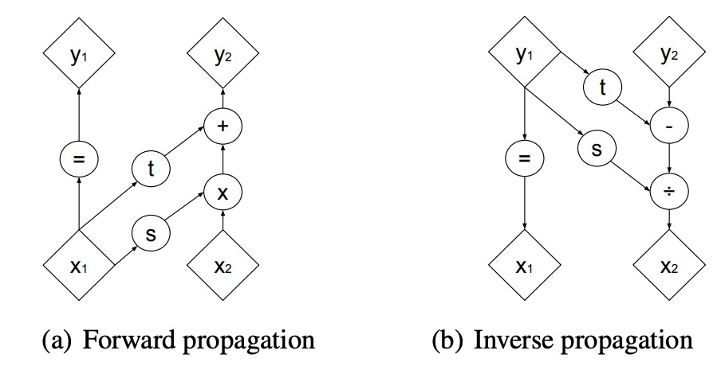

看此篇之前请先阅读 NICE 的资料.
RealNVP 与 Glow 是两篇在 NICE 基础上进行改进的模型. Glow 更是在生成高清图片的任务中取得了不错的效果.
## RealNVP

### 两种 split 的方式
为了能实现 CNN 在Flow 模型上的正确应用,作者给出了两种 split 的方式来保证了局部相关性.
#### 棋盘 split(checkboard-pattern)
在每一层中,如果以棋盘的方式进行分割, 我们就保证了局部相关性

#### 通道方向channel-wise
或者我们也可以直接不对同一通道进行 split, 可以对不同通道进行例如用 Red channel 去修正 Green channel. 但是如果只有一个 channel 怎么办? 作者还给出了 squeeze 的操作,首先先把整个图像分成四份(2x2) 之后把这四份拆成 4 个channel 就好了. 这个操作把 $s \times s \times c$ 变成了 $\frac{s}{2} \times \frac{s}{2} \times 4c$ 然后就可以进行 channel-wise 了.
RealNVP 同时用了上述两种方法, 在 squeeze前,用了 checkboard pattern spilt, squeeze 后用了 channel-wise split.

### 仿射耦合层
在 NICE 论文中,给出了additive coupling layer(加性耦合层)以及 ScaleLayer. 分别解决的了如何进行非线性变换以及为不同维度赋予权重的问题. 加性耦合层能进行非线性变换,但是其雅克比行列式固定为 1, 而 ScaleLayer 而雅克比行列式可以不为 1,但是却没有非线性变换. 那我们是不是可以找到一个办法直接把这俩结合起来, 反正即使行列式不唯一,但是只要满足是三角矩阵的话行列式依然比较好计算.
所以就有了仿射耦合层.
仿射耦合层的公式可以写成如下形式:
$$\left\{ \begin{aligned}y_1 = &x_1 \\
y_2 = &exp(s(x_1)) \odot x_2+t(x_1) \end{aligned}\right. $$
其中指数函数是为了保证$s$为正,避免行列式为负的情况.t函数与加性耦合层相同,区别在于仿射耦合层对 x2前面赋予了使用 x1 的函数作为系数. 那这样的话,雅克比行列式这一部分就是$\Pi s$了. 不过也算是比较好计算,并且s 函数同样不需要求逆.

### 多尺度变换
多尺度变换只是一个框架, 它完全不改变我们之前说的 flow 的具体运算, 唯一做的事情就是对于一部分维度多算了一次或多次而已. 图中的 z1 只算了一次, z3 在 z2 的基础之上又算了一遍这么做的原因是为了减少参数量, 节省内存, 所以在后续的论文中并没有采用这种技术, 可想效果应该也没有那么好. 

### Batch Norm
作为一个 CNN 模型那能少得了 BatchNorm 呢? BatchNorm就是把所有的除了 Channel 以外的层(也就是 N x H x W)做归一化. 做归一化的时候还会训练一个$\mu$以及$\sigma$
$$ x \mapsto \frac{x- \tilde{\mu}}{\sqrt{\tilde{\sigma}+\epsilon}} $$
同样也给出对应的雅克比行列式:
$$(\prod_i(\tilde{\mu}^2_i+\epsilon))^{-\frac{1}{2}}$$
## Glow
Glow 在 RealNVP 的基础之上做了一些规范化,使得其更容易理解一些. 

### 置换矩阵
在 RealNVP 中提到了基于 channel 的split 方式, 在 Glow 中这个split 操作被替换成了可训练的置换矩阵. 

### ActNorm
ActNorm 其实就是 BatchNorm, 平均了 NHW 但是保留了 C, 不过呢由于 RealNVP 中的 Affine Coupling Layer 计算量太大了, 我们的 BatchNorm 的 minibatch size 需要为 1 所以就变成了 ActNorm. 
### 1x1 卷积
1x1 卷积也是个常规操作了, 这里先展开讲一下它的一些常规应用
- 升维/降维
- 增加非线性
- 变换channel
在Glow中也是为了变换 channel 来达到 split 的效果, 不过计算雅克比矩阵的行列式就比较麻烦了
$$log\begin{vmatrix}det(\frac{dconv2D(\textup{\textbf{h}};\textup{\textbf{W}})}{d\textup{\textbf{h}}}) \end{vmatrix} = h \cdot w\cdot log|det(\textup{\textbf{W}})|$$
其中 h,w 都是宽和高的大小不需要计算, 但是 W 的行列式的时间复杂度是 $O(c^3)$ (个人感觉 c 为 3 的话也不大) 同时卷及操作的时间复杂度是$O(h\cdot w\cdot c^2)$ 为了简便计算我们初始化的时候直接用一个 random rotation matrix 就好了 这样子 log-det = 0 
另外为了求 det(W) 我们可以用LU 分解:
$$\textup{\textbf{W}} = \textup{\textbf{PL}}(\textup{\textbf{U}}+diag(s))$$ P是 permutation 矩阵, LU 分别代表下三角矩阵并且 L的对角线为 1, U的对角线为 0, s就是对角线了, 这样经过如此的分解, $$log\begin{vmatrix}det(\frac{dconv2D(\textup{\textbf{h}};\textup{\textbf{W}})}{d\textup{\textbf{h}}}) \end{vmatrix} = h \cdot w\cdot log|det(\textup{\textbf{W}})|=h \cdot w\cdot \Sigma(s)$$
在训练的时候我们首先先随机初始化一个 W 随后,对齐进行分解, 并固定 P 训练 L U 以及 s
## 最终效果
### RealNVP

相对于 NICE 来说已经好很多了, 起码能看出是个人了 还是彩色的.但是很多细节还是处理的不到位
### Glow

这是 openai 在高清人脸图像生成上的结果. 果然能将NormalizingFlow 模型带火的模型果然在生成图像的质量上要高出其他模型很多. 

Glow 作者在选择了两个样本之后去他们之间的插值做 sample 可以明显的看到, 渐变的效果还是相当不错的

作者还通过人工标注不同的属性,求得不同属性的差, 之后利用这个差值调整不同样本的属性. 确实能明显的看出NormalizingFLow 的生成质量确实相当不错.
不过作者也表明训练 Glow 需要相当大的资源,不是一般人能训练的了的.