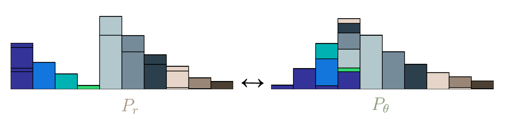

WAE在 VAE 基础上修改了 KL_loss 以此避免了 VAE 产生出的图片比较模糊的问题.
<!--more-->
## 问题阐述
VAE 有着天然的硬伤. VAE为了解决两点之间近似的问题,在 Encoder 产生出 mu(z)以及 sigma(z)之后引入了 reparameteration tricks , 同时也带来了一个符合正态分布的随机变量. 这个随机变量可以导致两个不同样本的输入在经过 Encoder 生成到 Z的时候会有可能产生相同的 Z. 所以相同的 Z会在训练 decoder 的时候被要求产生不同的输出. 因为这个 Z 会同时受制于多个输出的影响,当然就比较模糊了.
## 解决办法
避免这个问题的办法就是取消引入这个随机变量.但是一般的解决办法就退化成了 AE.所以作者尝试通过引入wasserstein 距离来计算
## 一些基础知识
### wasserstein distance
因为可以被形象的描述从从一个土堆中不断地搬土,直到把原土堆搬到另外一个地方,固又名推土机距离, 测量的是从一个分布变换到另一个分布之间的差异. 

以上图为例,$W(P_r,P_\theta) = $把每一块土搬过去的代价.这个代价有两部分,一部分是搬了多少量(weight)另一部分是搬了多远(distance). 当然因为搬土的过程是多种多样的,有的可能代价更大有的可能代价更小,所以这个距离衡量的其实是最小搬运代价
$$W_{c}\left(P_{X}, P_{G}\right):=\inf _{\Gamma \in \mathcal{P}\left(X \sim P_{X}, Y \sim P_{G}\right)} \mathbb{E}_{(X, Y) \sim \Gamma}[c(X, Y)]$$
