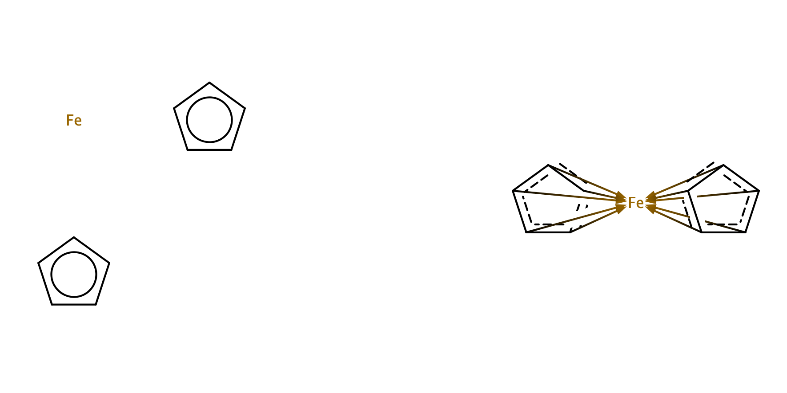

## TL;DR
做 MarvinSketch软件的ChemAxon 公司对 SMILES 进行了扩展,并将其称为CXSMILES(ChemAxon Extended SMILES) 即 ChemAxon 扩展的 SMILES. CXSMILES可以用于存储 SMILES 之外的一些特殊特征(信息). CXSMILES 表示方式类似 fasta 格式. 不过大部分情况不需要这些额外信息,用 SMILES 足矣.
<!--more-->
## 基本介绍
### CXSMILES基本格式
```SMILES_String |<feature1>,<feature2>,...|```
CXSMILES 不包括任何 non-ASCII 的字符.
The extended feature description is economic. If some feature is missing in the molecule, then the corresponding special characters are not written ( e.g .: If the atoms of the molecule has no alias strings at all, no "$" and ";" characters are written.). Moreover, if no feature of the molecule to be written, the extended feature field is omitted.
SMILES 表示的分子与 CXSMILES 表示的分子并不完全一样, 举个例子:二茂铁, SMILES 的写法如下: ```[Fe].c1cccc1.c1cccc1```这个表示并没有记录coordinate bonds, 不过在 CXSMILES 下写法如下```c12c3c4c5c1[Fe]23451234c5c1c2c3c45 |C:4.5,0.6,1.7,2.8,3.9,7.12,6.10,9.16,10.18,8.14|```. 二者的差异如下图所示(左为 SMILES,右为 CXSMILES):
