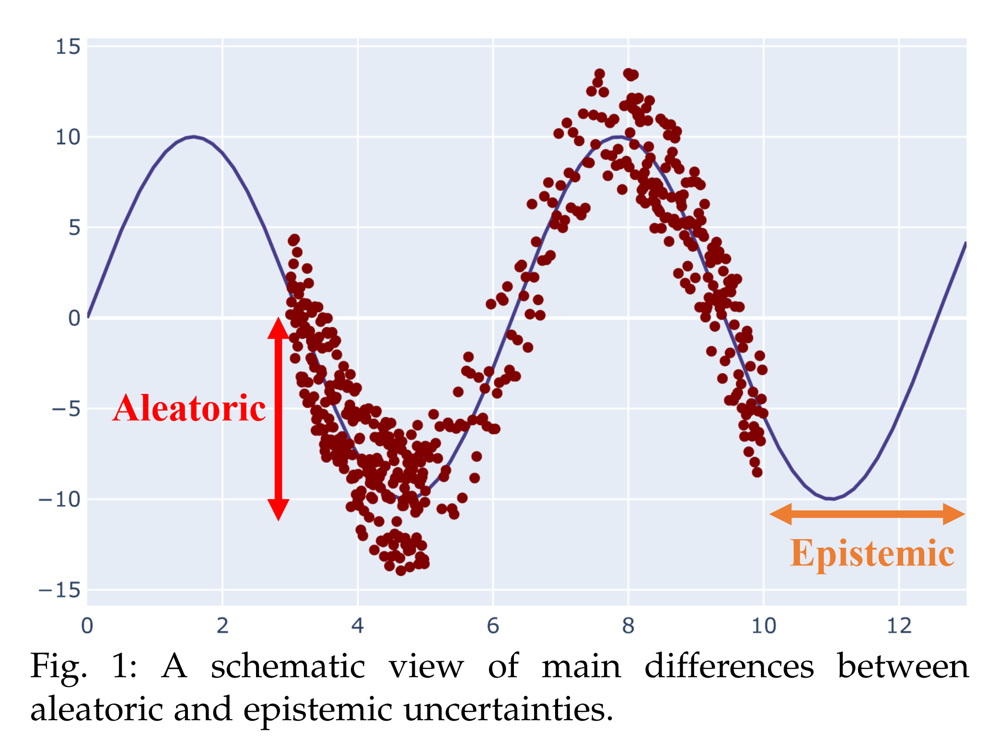

## TL;DR
不确定性量化（UQ）是一门定量描述和减少计算和现实世界应用中不确定性的科学。换句话说我们需要知道我们所做的判断有多大可能性是准的. 
自然科学和工程中的许多问题也充斥着不确定性的来源。关于计算机模拟的计算机实验是研究不确定性量化问题的最常见方法
<!--more-->
## 导语
说不确定性可以从一个小笑话开始:
> 面试官：“你简历上写着说你心算速度很快，那我问问你，13乘以19是多少？”
> 我脱口而出：“45！”
> 面试官：“这也差太远了吧。”
> 我：“你就说快不快吧！”

机器学习就像笑话里面的面试者一样, 可以轻易的给出一个答案, 但是这个答案一定准吗? 比如在预测猫狗的问题中的,给一张人的照片, 模型能给出一个是猫还是狗的答案, 但是这一定不是正确的. 原因也很简单, 我们给的人的照片不在猫狗训练集的范围之内,也就是我们的训练集分布和测试集分布不相同. 这与机器学习的假设是不相同的,我们之所以用训练集去训练就是因为我们希望的训练集的分布可以代表我们用于测试或者实际应用中的分布, 但是很遗憾,现实就是训练集的分布跟现实世界还不太一样, 所以很多情况下我们无法完全依赖神经网络, 尤其是预测错了的代价非常高的时候,比如自动驾驶(判断失误可能导致车毁人亡) 或者金融领域(重大决策失误).
你可能会想到,人在做决策判断的时候,有些时候是靠理性分析,有些时候是无法分析所以靠猜的.人是可以说出自己面对某个问题是不是瞎猜的,那我们能不能引入一个方法来让神经网络说出他预测的结果可信不可信呢? 这个方法就是__不确定性量化__
## 两种不确定性

不确定性分为两种,一种是内在(随机)不确定性, 另一种成为认知不确定性.
### 内在不确定性（Aleatoric Uncertainty）
内在不确定性, 也被称作Irreducible uncertainty, data
uncertainty,是指一些无法被确定的天然不确定性. 例如测量一起的精度不够高导致的误差, 我们不能通过增加更多样本来消除这种不确定性.例如上图中的 y 轴方向上的数据点, 由于某种测量误差导致多个数据点虽然 x 坐标是先沟通,但是 y 轴不同,也就是相同的输入但是不同的输出.
### 认知不确定性（Epistemic Uncertainty）
认知不确定性也被称作 knowledge
uncertainty. 认知不确定性表示的是模型对未知的正确预测程度.如上图所示,在数据点 x 的范围之外的点对于模型来说,因为完全没有见过这些点,所以不确定性是比较大的. 换句话说, 模型对于他见过的分布,他的预测是比较合理的, 对于没见过的数据点(超出了训练机的分布) 他的预测是自带了某种不确定性的, 这个不确定性就是认知不确定性. 降低认知不确定性的方法只有获得更多的数据(这些数据最好还是超出现有训练集分布的)

### 减小认知不确定性的方法
#### 内在不确定性减小方法
提升测量精度, 减少偶然误差
#### 认知不确定性减小方法
获取更多训练集的数据并希望新增的数据能够更进一步将训练集的分布于真实分布贴近.
### 如何利用不确定性
有了不确定性,我们面对很多现实问题可以处理的更保守/激进. 比如面对失败风险比较大的问题, 我们可以判断其预测结果的不确定性,对于不确定性高的问题引入专家介入从而降低模型的问题.
而面对希望渺茫的问题, 我们可以选择不确定性大的结果, 以此来增大预测失败的概率(预测的结果不好,但是预测对了的可能性比较低, 负负得正,这样更有可能预测出好结果)
除此之外,不确定性可以帮助找到不在训练集分布之内的例子, 对于不确定性大的例子可以人工挑选/检查/获取到确定的数据从而可以迭代优化模型,让模型下一次预测的更加准确.
## 认知不确定性的检测方法
我在这里把认知不确定性分为了两大类方法, 直接方法与间接方法
### 直接方法
直接方法可以从模型直接输出不确定性结果, 主动方法效果好, 但是改造成本高,难度大
  - Evidentail Model
  - BNN(贝叶斯神经网络)
  - GPR(高斯过程回归)
### 间接方法
间接方法主要采取的是多次测量的方法,根据每次输出结果的不同求方差得到不确定性.间接方法面临不确定性不够准的问题,但是优点是几乎不用对模型进行改造
  - Ensemble
  - Deep Ensemble( Ensembl 的优化版本)
  - MC Dropout
#### Ensemble
Ensemble 是一个很好的方法, 对于比较确定的输入,多个 Ensemble 模型给出的结果往往是比较接近的, 但是对于不确定的输入, Ensemble 往往会给出差异较大的结果. 因此,我们可以对每个样本在取输出的时候 不仅仅取每个模型输出结果的平均值, 同时也考虑一下方差,就可以简单了解对于这个样本来说的认知不确定性了. 
Ensemble 是针对多个模型的, 对于单个模型,我们可以用 dropout 来解决这个问题. 这个方法可以在不损失(甚至增加)模型精度的情况下比较好的测量不确定性. 唯一的缺点就是训练及预测成本比较高.

#### MC dropout
在预测的过程中依然保持 dropout 打开的状态,重复预测几次,这样就可以保证输出的结果是不太一样的. 记录下这些不一致的输出结果,我们可以求得方法, 以方差作为不确定性. 不过这种方法效果不是很好.
## 不确定性的校准(Calibration)
与神经网络模型输出一个预测结果不一定准一样, 神经网络模型输出的不确定性不一定是准的.我们当然希望这个不确定性输出结果是准的, 所以这就涉及到了不确定性校准的概念. 
### 何为准,何为不准
#### 对于分类问题
一般来讲,我们分类问题输出的结果表示的是一个概率值,也就是模型判断这个样本是正样本的概率有多大. 衡量这个概率准不准简单的做个统计就好了,我们从很多样本中选取预测概率值为 50% 的样本 N 个. 如果是一个经过校准的模型,那么这 N 个样本里应该恰好有 N/2 个样本是真实的正样本. 如果是一个没经过校准的模型那么就有可能有 N/3 或者 2N/3个样本是真实的样本了, 这也就代表了模型输出的概率值不能提现他预测出的概率, 这种模型可能面对分类问题本身有着良好的表先但是从概率的角度来看他还是欠校准的.
#### 对于回归问题
我们一般认为预测出的结果符合一个正态分布, 也就是说我们的真实值应该有 68%的概率落在预测值±1σ 95%的概率落在预测值±2σ中. 用与分类问题类似的方法我们可以统计这个概率 如果概率符合正态分布则说明这个不确定性是校准的